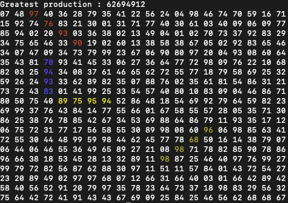
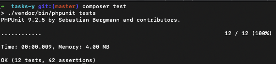
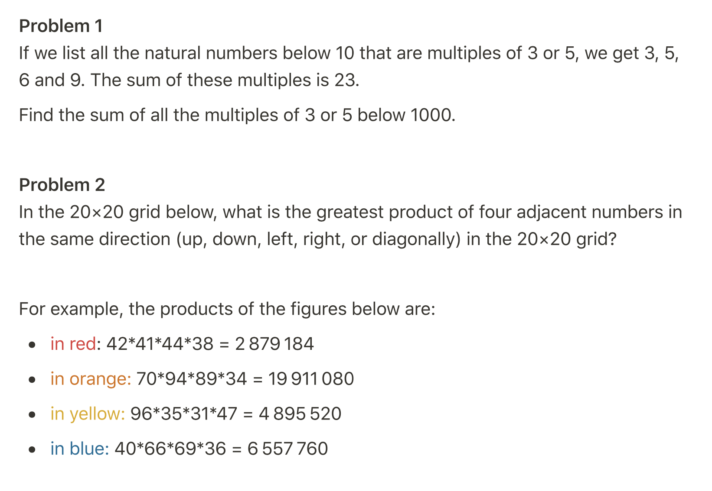
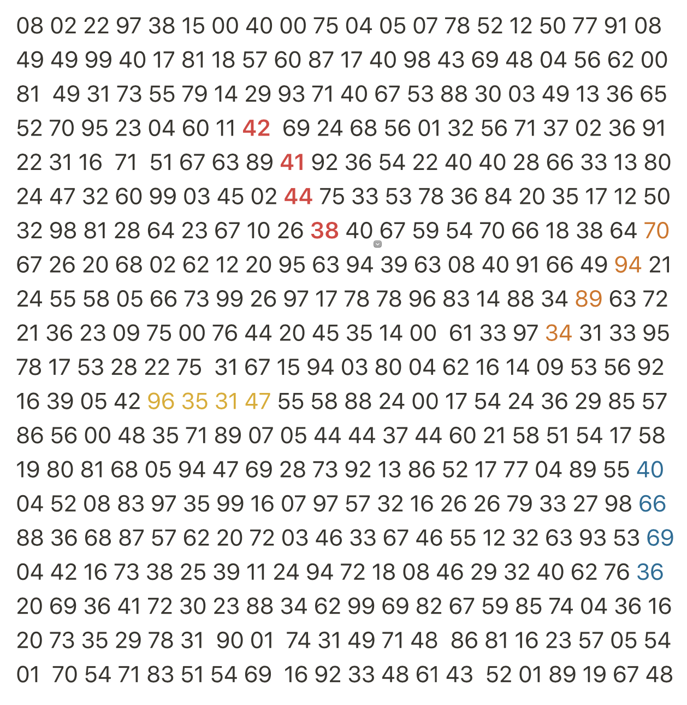

# Tasks
## Run example
```bash
composer install
php run.php
```


## Run tests
```bash
composer test
./vendor/bin/phpunit tests
```


## Task 1   
If we list all the natural numbers below 10 that are multiples of 3 or 5, we get 3, 5, 6 and 9. The sum of these multiples is 23.

Find the sum of all the multiples of 3 or 5 below 1000.

## Task 2
In the 20×20 grid below, what is the greatest product of four adjacent numbers in the same direction (up, down, left, right, or diagonally) in the 20×20 grid?




## Contact
* Anton Lytvynov
* lytvynov.anton@gmail.com
